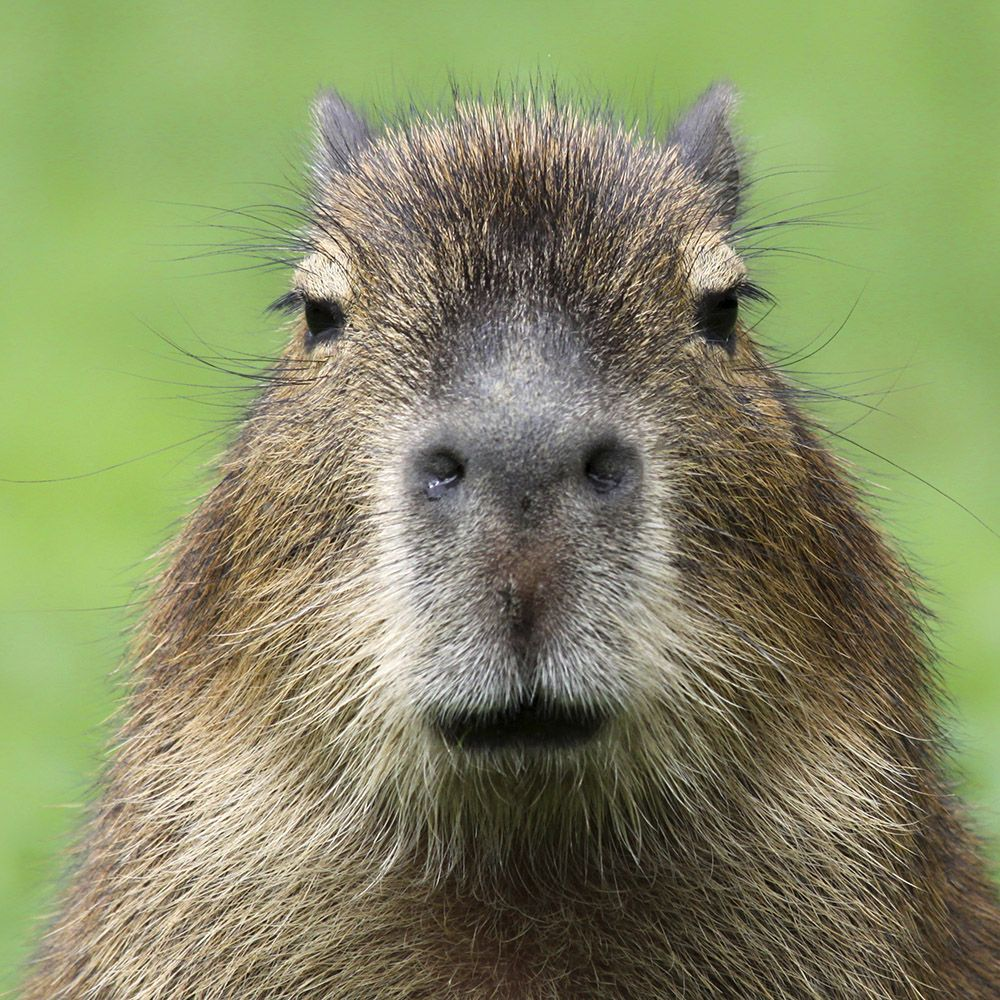

# We are headings!!!
## Heading 2

*I'm italicized :O*
**I'm BOLD >:D**
~~noooooo~~
***Wow I'm both?***

low...
high!

### Heading 3

> I'm a quote :)

I am a `quoted code`

[I'm the UCSD Link](https://ucsd.edu)

[I'm a section link. Going to heading 3!](#heading-3)

[Wanna see another md file?](./other.md)

- lists
- wow
- another one

1. dogs
2. cats
3. turtles

- [ ] Click me!
- [ ] No me!
- [x] I got clicked!!
- [ ] \(Optional) Don't have to click me...